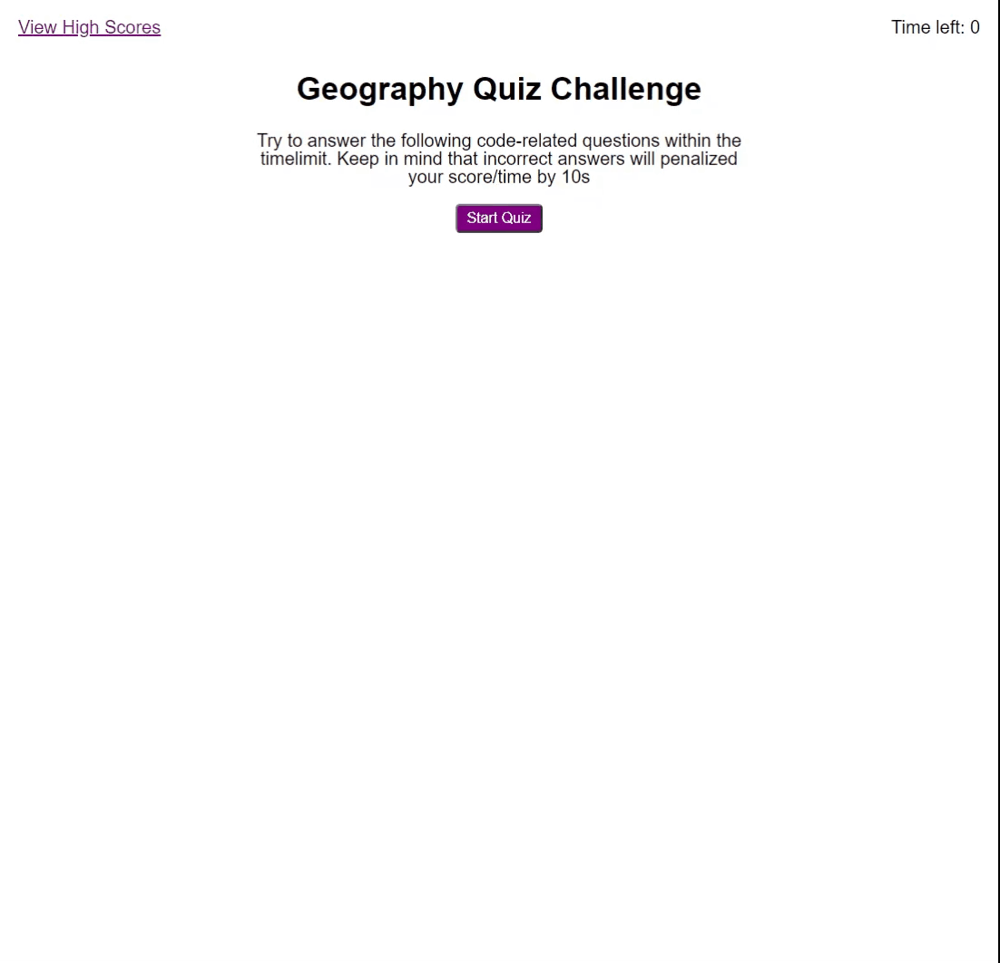
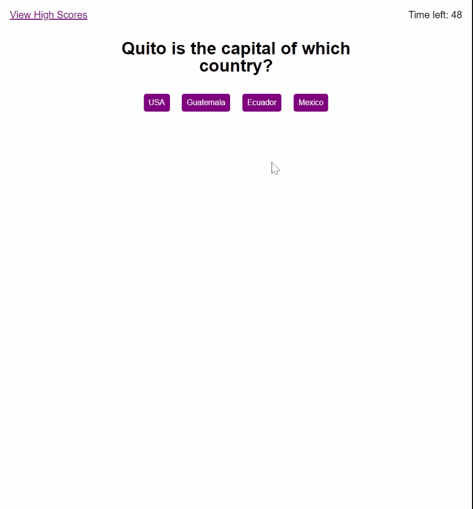
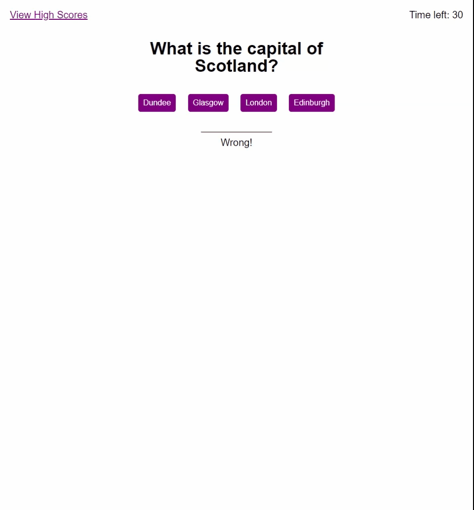
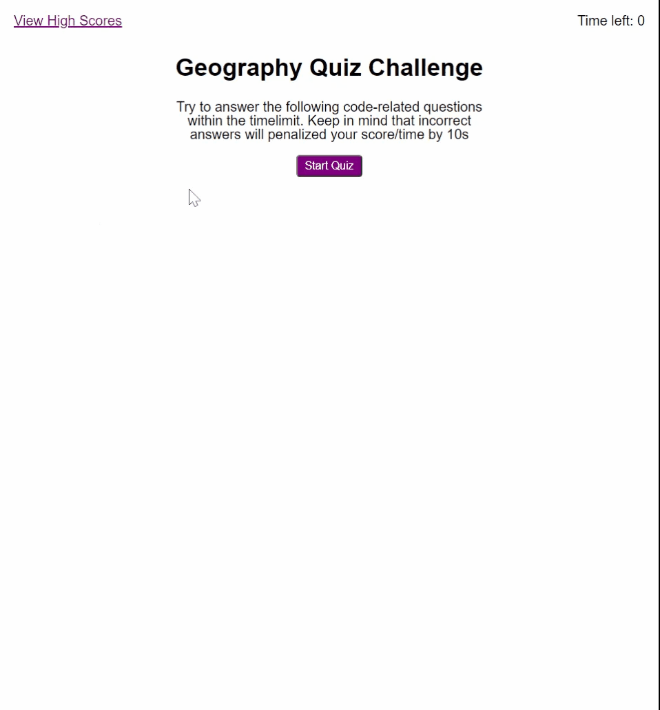

# Web APIs: Code Quiz

## Homework-4 JavaScript: Code Quiz

The purpose of this assignment is to utilize JavaScript to create a quiz. The quiz will test your geographical knowledge. 

You can review the current password generator application by going to the following url: https://santipalacios2002.github.io/code-quiz/

 

# Acceptance criteria
## :heavy_check_mark: Start button

When click on start button, you will be presented with the first question and the timer coundown starts

 

## :heavy_check_mark: Loop through questions, Incorrect question

The user will begin answering questions.  With each question answered, the user will progress to the next question. With each incorrect answer, the clock is deducted 10 seconds. 

 

## :heavy_check_mark: Game over

The game is over if you answer all the questions or the timer reaches 0

 

 

## :heavy_check_mark: Enter initials an view Highscores

Once the game is over, user can their initials, click "submit" which will store the score and direct them to the "Highscores" page.  This page can also be accessed via the "View highscores" link in the top, and will display highscores from highest to lowest. When "clear Scores" is clicked, all scores will be deleted. 

## :heavy_check_mark: Lessons learned

* In order to ensurer timer ends at zero, some saguards were put in place so the final score is never less than zero.
* function sort needed to be used in order to get highscores sorted from highest to lowest

